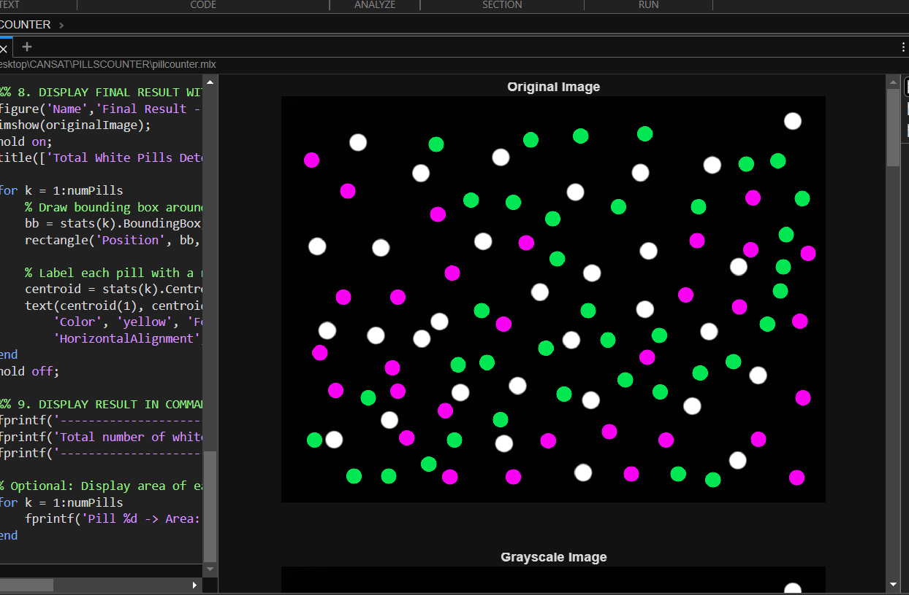
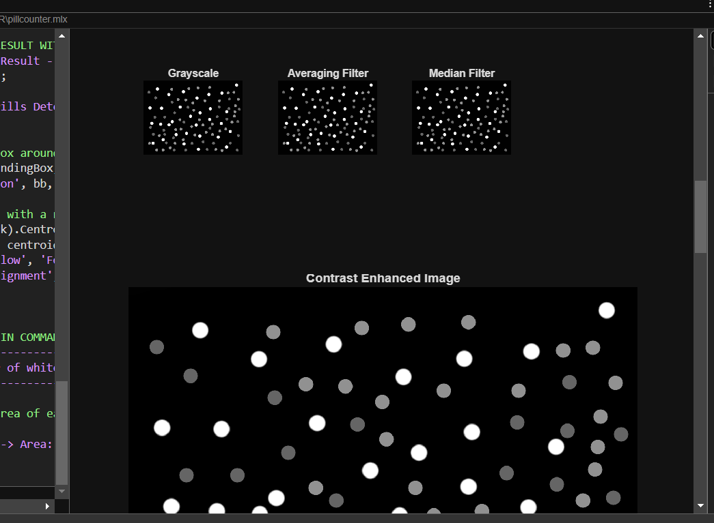
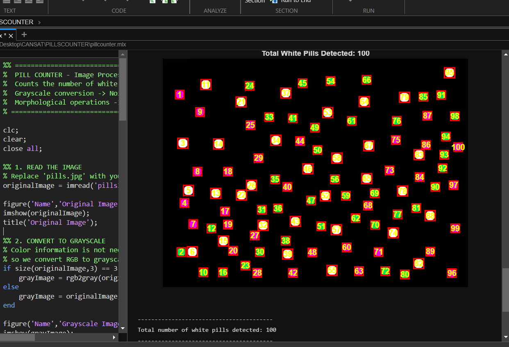

# pillscounter-matlab
Automated Pill Counting Using Digital Image Processing in MATLAB
# Automated White Pill Counting Using Digital Image Processing in MATLAB

## Project Overview
This project presents an automated system for counting the number of white pills present in a digital image using fundamental digital image processing techniques implemented in MATLAB[cite: 1]. The system successfully eliminates manual counting errors in pharmaceutical packaging, quality control, and inventory management by leveraging a structured pipeline of filtering, thresholding, and morphological analysis[cite: 1].

---

## Screenshots & Visual Results
* **`screenshot1.png`**: Displays the raw, unaltered input image of the white pills captured against a contrasting background.  
  

* **`screenshot2.png`**: Shows the intermediate processing stages, including the grayscale conversion, filtered outputs, and Otsu's binary mask.  
  

* **`resultshot.png`**: Demonstrates the final output featuring overlaid bounding boxes and sequential numeric labels over each identified pill, along with the total count displayed in the title.  
  

---

## Table of Contents
1. Introduction[cite: 1]
2. Objectives[cite: 1]
3. Literature Background / Theoretical Concepts[cite: 1]
4. System Requirements[cite: 1]
5. Proposed Methodology[cite: 1]
6. Algorithm and Flowchart[cite: 1]
7. MATLAB Implementation (Code)[cite: 1]
8. Detailed Explanation of Code Modules[cite: 1]
9. Results and Discussion[cite: 1]
10. Advantages[cite: 1]
11. Limitations[cite: 1]
12. Applications[cite: 1]
13. Future Scope[cite: 1]
14. Conclusion[cite: 1]
15. References[cite: 1]

---

## 1. Introduction
Digital Image Processing (DIP) uses computer algorithms to manipulate and analyze digital images for industrial automation, quality inspection, and medical applications[cite: 1]. Accurately counting tablets or capsules during packaging and quality assurance is critical, and manual methods are slow and prone to errors[cite: 1]. This project automates white pill counting using MATLAB's Image Processing Toolbox[cite: 1].

## 2. Objectives
* Design an automated image processing pipeline to detect and count white pills[cite: 1].
* Apply averaging and median filtering for noise reduction[cite: 1].
* Implement automatic thresholding via Otsu's method[cite: 1].
* Utilize morphological operations to refine segmented regions[cite: 1].
* Label connected components and validate results visually with bounding boxes[cite: 1].

## 3. Theoretical Concepts
* **Grayscale Conversion**: Reduces 3-channel RGB matrices to a single intensity channel to lower computational complexity[cite: 1].
* **Filtering**: Mean filters smooth general intensity variations while median filters preserve sharp object boundaries against noise[cite: 1].
* **Otsu's Method**: Automatically calculates the optimal threshold by minimizing intra-class variance[cite: 1].
* **Morphological Operations**: Employs operations like opening, closing, and hole-filling with a disk structuring element to clean up shapes[cite: 1].
* **Connected Component Labeling**: Assigns unique integers to grouped foreground pixels to determine the total count[cite: 1].

## 4. System Requirements
* **Software**: MATLAB R2018a or later with the Image Processing Toolbox (compatible with Windows, macOS, and Linux)[cite: 1].
* **Hardware**: Standard PC/laptop with a minimum of 4 GB RAM and a digital image of white pills[cite: 1].

## 5. Proposed Methodology
1. **Image Acquisition**: Load the RGB image using `imread()`[cite: 1].
2. **Grayscale Conversion**: Convert to a single channel using `rgb2gray()`[cite: 1].
3. **Noise Removal**: Filter using median and averaging techniques[cite: 1].
4. **Contrast Enhancement**: Stretch intensity ranges with `imadjust()`[cite: 1].
5. **Thresholding**: Apply Otsu's thresholding via `graythresh()` and `imbinarize()`[cite: 1].
6. **Morphological Refinement**: Clean objects using `imopen`, `imclose`, and hole-filling[cite: 1].
7. **Connected Component Labeling**: Isolate and count regions via `bwlabel()`[cite: 1].
8. **Visualization**: Overlay bounding boxes and centroids using `regionprops()`[cite: 1].

## 6. Algorithm & Flowchart Summary
* Input Image $\rightarrow$ Grayscale Conversion $\rightarrow$ Median Filtering $\rightarrow$ Contrast Adjustment $\rightarrow$ Otsu Thresholding $\rightarrow$ Morphological Cleanup $\rightarrow$ Component Labeling $\rightarrow$ Visualization & Count Report[cite: 1].

eferences (`graythresh`, `imbinarize`, `regionprops`, `bwlabel`)[cite: 1].
3. Otsu, N. (1979). "A Threshold Selection Method from Gray-Level Histograms," IEEE Transactions on Systems, Man, and Cybernetics[cite: 1].
